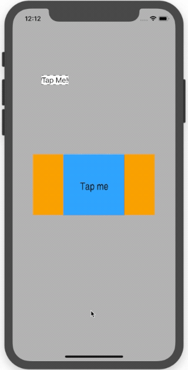

# MarchingAnts

MarchingAnts is a Swift Package allows you to add a `marching ants` effect to a CALayer, or such as `UIView.layer`.



If you wish to show `marching ants` effect around a `UILabel` in your View Controller, with property name of `label` 
1. Add `https://github.com/simonkim/MarchingAnts` as  Swift Package Dependency to your Xcode project. See [Adding Package Dependencies to Your App](https://developer.apple.com/documentation/xcode/adding_package_dependencies_to_your_app) 
2. `import MarchingAnts` from your View Controller source file,
3. Set `isMarchingAntsVisible` property of the desired view's `layer` property: `self.label.layer.isMarchingAntsVisible = true` if your View Controller has a property `label` of type `UILabel`

Usage
```swift
import MarchingAnts
...
let imageView = UIImageView()
imageView.layer.isMarchingAntsVisible = true
```

Rectangular Marching Ants with custom colors
```swift
import MarchingAnts
...

let label = UIView(frame: CGRect(x: 0, y: 0, width: 100, height: 100)

let ants = MarchingAnts(
    antColor: UIColor.red, 
    strokeColor: UIColor.blue
).boundingAnts(rect: label.bounds)

label.layer.addSublayer( ants )
```

Marching Ants with custom shape using `CGPath`
```swift
import MarchingAnts
...
let label = UIView(frame: CGRect(x: 0, y: 0, width: 100, height: 100)

let customPath = UIBezierPath(...)
let ants = MarchingAnts().animatingAnts(path: customPath.cgPath)

label.layer.addSublayer( ants )
```


